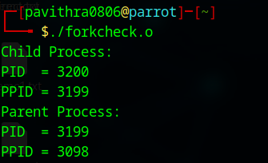
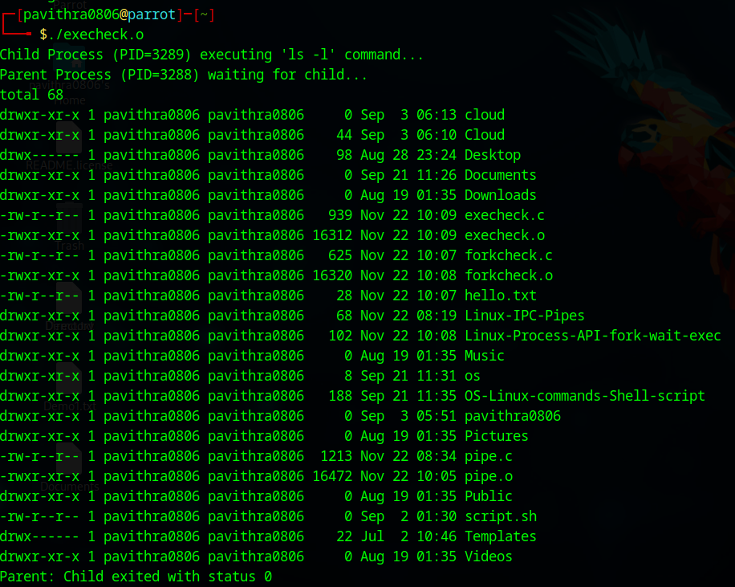

# Ex02-OS-Linux-Process API - fork(), wait(), exec()
Operating systems Lab exercise

# NAME:Pavithra D
# REGISTER NUMBER: 212223230146

# AIM:
To write C Program that uses Linux Process API - fork(), wait(), exec()

# DESIGN STEPS:

### Step 1:

Navigate to any Linux environment installed on the system or installed inside a virtual environment like virtual box/vmware or online linux JSLinux (https://bellard.org/jslinux/vm.html?url=alpine-x86.cfg&mem=192) or docker.

### Step 2:

Write the C Program using Linux Process API - fork(), wait(), exec()

### Step 3:

Test the C Program for the desired output. 

# PROGRAM:

## C Program to print process ID and parent Process ID using Linux API system calls

```
#include <stdio.h>
#include <unistd.h>
#include <stdlib.h>
#include <sys/wait.h>

int main() {
    pid_t pid;

    pid = fork();

    if (pid < 0) {
        perror("fork failed");
        exit(1);
    }
    else if (pid == 0) {
        // Child process
        printf("Child Process:\n");
        printf("PID  = %d\n", getpid());
        printf("PPID = %d\n", getppid());
        exit(0); // Child exits cleanly
    }
    else {
        // Parent process waits
        wait(NULL);
        printf("Parent Process:\n");
        printf("PID  = %d\n", getpid());
        printf("PPID = %d\n", getppid());
    }

    return 0;
}

```


## Output :



## C Program to create new process using Linux API system calls fork() and exit()

```
#include <stdio.h>
#include <stdlib.h>
#include <unistd.h>
#include <sys/wait.h>

int main() {
    pid_t pid;

    pid = fork();   // Create a child process

    if (pid < 0) {
        perror("fork failed");
        exit(1);
    }
    else if (pid == 0) {
        // Child process
        printf("Child Process (PID=%d) executing 'ls -l' command...\n", getpid());

        // Replace child with 'ls -l'
        execlp("ls", "ls", "-l", NULL);

        // If exec fails:
        perror("exec failed");
        exit(1);
    }
    else {
        // Parent process
        int status;
        printf("Parent Process (PID=%d) waiting for child...\n", getpid());

        wait(&status);   // Wait for child to finish

        if (WIFEXITED(status)) {
            printf("Parent: Child exited with status %d\n", WEXITSTATUS(status));
        } else {
            printf("Parent: Child terminated abnormally\n");
        }
    }

    return 0;
}
```

## OUTPUT:




## Result:

Thus the pipes are executed successfully